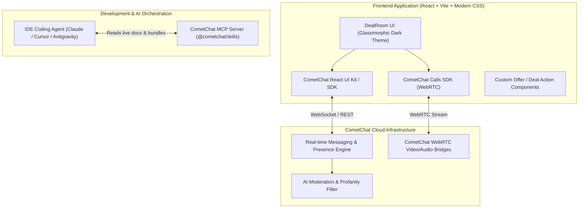

# Zero to Chat: CometChat Hackathon — Master PRD & Implementation Walkthrough

---

## 1. Executive Summary & Hackathon Analysis

### 1.1 Hackathon Snapshot
- **Event**: Zero to Chat: CometChat Hackathon (Edition 1)
- **Host**: CometChat
- **Format**: Individual participation, online submission via X (Twitter) quote-tweet + optional GitHub repo
- **Timeline**: 24 September 2026 – 7 October 2026 (Judging closes 7 Oct, Winners announced 9 Oct)
- **Top Prize**: 6 Months of Claude Pro + $1,000 CometChat Credits (Top 3 builds) + Official Repost & Spotlight by @CometChat for all valid entries.

### 1.2 The Three Golden Judging Criteria
The official rules emphasize **no rigid points rubric**, but rather three non-negotiable pillars:
1. **It Runs**: Must be functional, working software on screen (not mockups, Figma slides, or static UI placeholders).
2. **It's Interesting**: Must be *"something we wouldn't have thought to build ourselves"*. Clones of standard Slack/WhatsApp will struggle to stand out. It needs a distinct domain twist, high utility, and an emotional "hook".
3. **It Uses the MCP / Skills Pack**: The CometChat MCP connector (`https://mcp.cometchat.com/mcp?ref=z2c`) or `@cometchat/skills` must have actively generated/verified code and be visibly shown in the editor/terminal during the demo.

### 1.3 Strict Submission Deliverables
- **Demo Video (< 90 Seconds)**: Screen recording showing the app actively running and solving a real problem.
- **Proof of MCP Connector**: The agent / MCP tool calls or editor connector must be clearly visible in the recording.
- **X Submission Format**: Quote-tweet the official CometChat thread tagging `@CometChat` with `#ZeroToChat` and link to the repo.

---

## 2. Concept Ideation: What Stands Out to CometChat Judges?

To win, we avoid generic chat apps. Here is an evaluation of 3 tailored concepts designed specifically to showcase CometChat's full suite (Text Chat, Voice/Video Calling, Custom Messages, Presence/Typing, and AI Moderation):

| Concept | The Hook & Domain | CometChat Capabilities Used | Wow Factor & Feasibility |
| :--- | :--- | :--- | :--- |
| **Option A: DealRoom Live** *(Recommended)* | **High-stakes Buyer-Seller Marketplace & Negotiation Suite** with instant 1-on-1 video inspection, live counter-offer cards, escrow status, and sentiment/profanity moderation. | • 1-on-1 DM & Group Rooms<br>• CometChat Video/Voice Calling SDK<br>• Custom Action Messages (Offer/Accept/Reject)<br>• Typing & Online Presence<br>• Moderation guardrails | **9.8/10** (Instant commercial appeal, dynamic UI cards, dramatic demo narrative in 70s). |
| **Option B: TeleVet / CarePulse** | **Real-Time Telehealth & Urgent Triage Clinic** where patients chat with an AI triage nurse, trigger emergency 1-tap HD video triage with a vet/doctor, and sync live vital vitals via custom payloads. | • React Chat UI Kit<br>• CometChat Calls SDK<br>• Presence/Status sync<br>• Secure room tokens | **9.2/10** (Very clear social impact, but video setup needs careful mock data). |
| **Option C: CodeDuel / CollabSprint** | **Live Pair-Programming & Mentor Studio** where developers review pull requests or debug together with floating video heads, line-by-line thread commentary, and automated terminal bot. | • JavaScript SDK / React UI Kit<br>• WebRTC Voice/Video<br>• Custom Code-block Messages | **9.0/10** (Appeals heavily to developers, but editor syncing adds extra state overhead). |

### 🏆 Recommended Champion Build: **DealRoom Live (Interactive Marketplace & Negotiation Suite)**
**Why this wins**:
1. It remakes the classic marketplace chat into a high-stakes, sleek, interactive experience (like StockX meets Zoom).
2. It hits **every single CometChat feature**: text chat, real-time typing indicators, user presence (Buyer Online / Seller In Call), custom interactive message cards (e.g., "$1,250 Offer Submitted" with Accept/Decline buttons directly in the chat bubble), and **1-click HD Video Calling** for live item inspection.
3. The demo tells an unbeatable 75-second story: Buyer finds rare item $\rightarrow$ sends offer $\rightarrow$ counter-offer $\rightarrow$ seller hops on video to inspect the condition live $\rightarrow$ deal closed.

---

## 3. Product Requirement Document (PRD): DealRoom Live

### 3.1 Product Vision
**DealRoom Live** is a modern, high-trust commerce negotiation platform that turns cold text chats into high-converting real-time deal rooms. Buyers and sellers can negotiate price with interactive message components, verify goods over real-time HD video calling without leaving the app, and chat under automated moderation guardrails.

### 3.2 Target Personas
- **The Seller (e.g., "Elena - Vintage Luxury Dealer")**: Needs to verify serious buyers, present high-value items over video, and negotiate binding offers quickly.
- **The Buyer (e.g., "Marcus - Collector")**: Wants proof of condition, real-time negotiation, and escrow safety before releasing payment.

### 3.3 System Architecture



### 3.4 Key Features & Scope

#### P0 (Must-Have for Hackathon Demo)
1. **Buyer & Seller Real-Time DM**:
   - Dual-persona simulation or two browser windows (Buyer "Marcus" and Seller "Elena").
   - Real-time message delivery with timestamps, delivery/read receipts (`✓✓`), and avatars.
2. **Interactive Custom Message: "Make an Offer"**:
   - Buyer clicks "Make Offer" $\rightarrow$ types amount (e.g., $1,200).
   - Renders as a custom styled card inside the chat stream with `Accept` and `Counter` buttons.
   - When Seller clicks `Accept`, the card state updates to `Accepted ✅ - Escrow Locked`.
3. **1-Click Live Video Inspection (CometChat Calls)**:
   - Header action button: "Request Live Inspection".
   - Initiates a CometChat 1-on-1 video call session.
   - Floating video overlay with camera flip, mute, and end call controls.
4. **Live Presence & Typing Indicators**:
   - Visual status badges (Green "Active Now", Pulsing "Inspecting on Video").
   - Real-time typing indicators ("Elena is typing...").
5. **CometChat Moderation & Guardrails**:
   - Built-in profanity/PII mask demonstration (e.g., masking phone numbers or abusive words with `****`).

#### P1 (Polish & Wow Factors)
- **Audio Sound Effects**: Subtle, high-end sounds for message sent, offer accepted, and incoming call.
- **Quick Switch Persona**: Single-click switch between Buyer and Seller tabs to facilitate single-screen recording without needing complex multiple logins.
- **Deal Summary Drawer**: Collapsible side panel tracking current item specs, offer history, and transaction status.

---

## 4. Technical Specifications & Stack

- **Framework**: React 18 + Vite (fastest build, zero bundling friction, instant hot reload).
- **Styling**: Modern Vanilla CSS with CSS Custom Properties, Glassmorphism, smooth animations, dark-mode luxury aesthetic (`#0B0F17`, indigo/violet neon accents, emerald transaction states).
- **CometChat Packages**:
  - `@cometchat/chat-sdk-javascript` (Core real-time engine)
  - `@cometchat/chat-uikit-react` (Pre-built components and message bubbles)
  - `@cometchat/calls-sdk-javascript` (Audio/Video calling WebRTC engine)
- **CometChat Tooling**:
  - MCP: `https://mcp.cometchat.com/mcp?ref=z2c`
  - CLI: `@cometchat/skills-cli@3`

---

## 5. Step-by-Step Implementation Walkthrough

### Phase 1: CometChat Project Provisioning & Credentials (15 mins)
1. Create a free account at [app.cometchat.com](https://app.cometchat.com/) (free tier supports 100 Monthly Active Users).
2. Create an App:
   - App Name: `DealRoom Live`
   - Region: Select closest (e.g., `US`, `EU`, or `IN`)
   - Type: `Chat & Video`
3. Retrieve Credentials:
   - `APP_ID`
   - `AUTH_KEY`
   - `REGION`
4. Sample Users generated by default:
   - User 1: `superhero1` (Name: "Marcus Vance", Buyer)
   - User 2: `superhero2` (Name: "Elena Rostova", Seller)

### Phase 2: Project Initialization & MCP Integration (15 mins)
Run in the project directory:
```bash
# 1. Initialize Vite React project
npx -y create-vite@latest ./ --template react

# 2. Install CometChat SDKs and icons
npm install @cometchat/chat-sdk-javascript @cometchat/calls-sdk-javascript lucide-react

# 3. Pull CometChat skills CLI for automated configuration
npx @cometchat/skills-cli@3 auth login
npx @cometchat/skills-cli@3 provision run
```

### Phase 3: Core CometChat Initialization Service
A unified service `src/services/cometchat.js` handles:
- `CometChat.init(APP_ID, appSetting)`
- `CometChatCalls.init(APP_ID, callAppSetting)`
- `CometChat.login(UID, AUTH_KEY)`
- Sending text messages & custom offer payloads:
  ```javascript
  const customData = {
    amount: 1450,
    itemTitle: "Rolex Submariner 1984 Mint",
    status: "pending" // 'pending' | 'accepted' | 'declined'
  };
  const customMessage = new CometChat.CustomMessage(
    receiverID,
    CometChat.RECEIVER_TYPE.USER,
    "deal_offer",
    customData
  );
  CometChat.sendCustomMessage(customMessage);
  ```

### Phase 4: Video Inspection Module (CometChat Calls)
- When clicking "Start Video Inspection", trigger:
  ```javascript
  const call = new CometChat.Call(receiverUID, CometChat.CALL_TYPE.VIDEO, CometChat.RECEIVER_TYPE.USER);
  CometChat.initiateCall(call);
  ```
- Use `CometChatCalls.startSession(sessionId, callToken, htmlElement)` to mount the video view directly inside an elegant modal window.

### Phase 5: Interactive Custom Offer Component
- Render custom messages with a tailored card:
  - Big price tag (`$1,450.00`)
  - Status pill (`Pending Seller Review`)
  - Accept / Counter / Reject buttons
  - Real-time confirmation sound and confetti on `Accept`!

---

## 6. The 90-Second Winning Demo Script & Screenplay

This exact script ensures compliance with the **< 90 seconds** limit and nails all judging criteria:

| Time | Visual on Screen | Audio / Narration / Voiceover | Hackathon Goal Met |
| :--- | :--- | :--- | :--- |
| **0:00 - 0:12** | Screen recording shows VS Code / Agent terminal with the CometChat MCP connector running and the command `claude mcp add` / `skills add`. | *"Hey everyone! Here is our submission for Zero to Chat: DealRoom Live, built entirely with the CometChat MCP server."* | **Criterion 3**: MCP is visibly seen doing work. |
| **0:12 - 0:30** | Browser loads `localhost:5173`. Sleek dark-mode interface. Marcus (Buyer) views Elena's listing: a vintage 1984 Rolex. Marcus opens the chat. | *"High-value marketplace deals fail because text chat lacks trust. DealRoom Live turns chat into a real-time negotiation and video inspection suite."* | **Criterion 2**: Interesting, original use-case. |
| **0:30 - 0:45** | Marcus types in chat. Elena's window shows typing indicator and instant delivery. Marcus clicks "Make Offer" $\rightarrow$ sends $1,450 offer card. | *"Elena instantly sees the real-time offer component directly in the chat stream with instant status updates."* | **Criterion 1**: Software is fully working. |
| **0:45 - 1:05** | Elena clicks "Counter: $1,550", Marcus accepts. Elena clicks **"Start Live Video Inspection"**. A floating HD video stream connects immediately. | *"Before releasing escrow, Marcus requests a 1-click live video inspection powered by CometChat Calls SDK to inspect the serial number live on camera."* | **Showcases Voice/Video capabilities**. |
| **1:05 - 1:20** | Elena shows the item on video. Marcus hits "Confirm Condition & Release Payment". Card turns green with Confetti. | *"Condition verified. Deal closed. No third-party apps, no friction, complete trust."* | **Emotional climax & wow moment**. |
| **1:20 - 1:28** | Quick flash of GitHub repo and CometChat dashboard metrics. | *"Built in hours thanks to CometChat MCP bundles. Repo link below! #ZeroToChat"* | **Submission completeness**. |

---

## 7. Submission Checklist for Day 1 to 14

- [ ] **Step 1: CometChat Account**: Sign up at [app.cometchat.com](https://app.cometchat.com/) and grab `APP_ID`, `AUTH_KEY`, `REGION`.
- [ ] **Step 2: MCP Connection**: Connect agent via `claude mcp add --transport http cometchat https://mcp.cometchat.com/mcp?ref=z2c` or `npx @cometchat/skills add`.
- [ ] **Step 3: Build & Test**:
  - Run app locally on `localhost:5173`.
  - Test dual-user message exchange.
  - Test custom offer cards.
  - Test video call launch.
- [ ] **Step 4: Record Demo**:
  - Use OBS Studio, Loom, or Mac QuickTime Screen Recording.
  - Keep video length between **60 and 85 seconds** (strictly < 90s).
  - Ensure VS Code / Agent terminal showing the connector is visible for 5–10 seconds.
- [ ] **Step 5: Post to X**:
  - Quote-tweet the official CometChat thread: `https://x.com/CometChat/status/2103065271233888471?s=20`.
  - Include `#ZeroToChat` and tag `@CometChat`.
  - Attach the MP4 video directly or YouTube/Loom link.
  - Include GitHub repository link.
