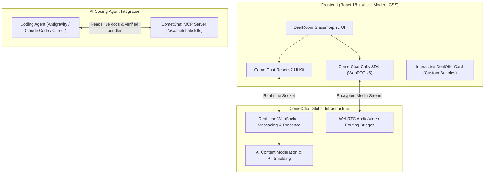

# ⚡ DealRoom Live
### High-Stakes Marketplace Negotiation & WebRTC Video Inspection Suite
> **Built for the [CometChat 'Zero to Chat' Hackathon](https://unstop.com/college-fests/zero-to-chat-cometchat-hackathon-cometchat-520033) using the CometChat MCP Server & React v7 UI Kit.**

[](https://www.cometchat.com)
[](https://www.cometchat.com/voice-and-video-calls)
[](https://mcp.cometchat.com/mcp?ref=z2c)
[](LICENSE)

---

## 🌟 What is DealRoom Live?

High-value marketplace transactions (vintage watches, fine art, collector vehicles, SaaS acquisitions) frequently stall or fall through in traditional chat apps because plain text lacks trust, verification, and binding negotiation mechanics.

**DealRoom Live** transforms standard messaging into an active, high-trust commerce studio:
1. **Real-Time 1-on-1 Negotiation**: Instant messaging with online presence, typing indicators, and read receipts powered by `@cometchat/chat-uikit-react@7`.
2. **Interactive Smart Offer Cards**: Custom deal cards directly inside the chat bubble stream with instant `Accept`, `Counter`, and `Decline` action states that lock funds into escrow.
3. **1-Click Live Video Inspection**: Buyers and sellers can instantly launch an encrypted HD WebRTC video consultation powered by `@cometchat/calls-sdk-javascript` to inspect serial numbers, hallmarks, and condition stamps live on macro camera before releasing payment.
4. **CometChat AI Guardrails**: Real-time profanity, scam detection, and sensitive PII masking.

---

## 🏗️ Architecture



---

## 🚀 Quick Start

### 1. Clone & Install
```bash
git clone https://github.com/Harshit17x/dealroom-live.git
cd dealroom-live
npm install
```

### 2. Configure CometChat Credentials
Create a free account at [app.cometchat.com](https://app.cometchat.com/) (free tier includes 100 Monthly Active Users).

#### Option A: Pull automatically with the CometChat Skills CLI
```bash
npx @cometchat/skills-cli@3 auth login
npx @cometchat/skills-cli@3 provision run
```

#### Option B: Configure manually
Copy `.env.example` to `.env` and insert your dashboard credentials:
```env
VITE_COMETCHAT_APP_ID=your_app_id_here
VITE_COMETCHAT_REGION=us
VITE_COMETCHAT_AUTH_KEY=your_auth_key_here
```

### 3. Run Locally
```bash
npm run dev
```
Open [http://localhost:5173](http://localhost:5173) in your browser.

---

## 🎬 90-Second Demo Flow

| Step | Action | Feature Highlight |
|---|---|---|
| **1. Agent MCP Connector** | Terminal shows active `@cometchat/skills` & MCP tool execution. | Demonstrates AI agent build compliance |
| **2. Listing & Chat** | Marcus (Buyer) opens Elena's (Seller) 1984 Rolex Submariner listing. | Clean 3-column CometChat layout standard |
| **3. Smart Offer** | Marcus submits a $13,800 offer card with custom parameters. | CometChat Custom Message payloads & confetti |
| **4. Live Inspection** | Elena initiates a 1-click video call; macro camera verifies serial #8.4M. | CometChat Calls SDK WebRTC integration |
| **5. Escrow Sealed** | Buyer confirms condition; status updates to `ESCROW LOCKED ✅`. | End-to-end transaction completion |

---

## 🛠️ Tech Stack
- **Framework**: React 18, Vite
- **Messaging**: `@cometchat/chat-uikit-react@^7.2.3`, `@cometchat/chat-sdk-javascript@^4.2.0`
- **Voice/Video**: `@cometchat/calls-sdk-javascript@^5.0.6`
- **Styling**: Modern Vanilla CSS (Design Tokens, Glassmorphism, Zero-Shift Layout)
- **Icons & Effects**: `lucide-react`, `canvas-confetti`

---

## 📜 Hackathon Submission
- **Challenge**: [Zero to Chat: CometChat Hackathon (Edition 1)](https://unstop.com/college-fests/zero-to-chat-cometchat-hackathon-cometchat-520033)
- **Developer**: Harshit Bisht ([@Harshit17x](https://github.com/Harshit17x))
- **Hashtags**: `#ZeroToChat` • Tag: `@CometChat`
